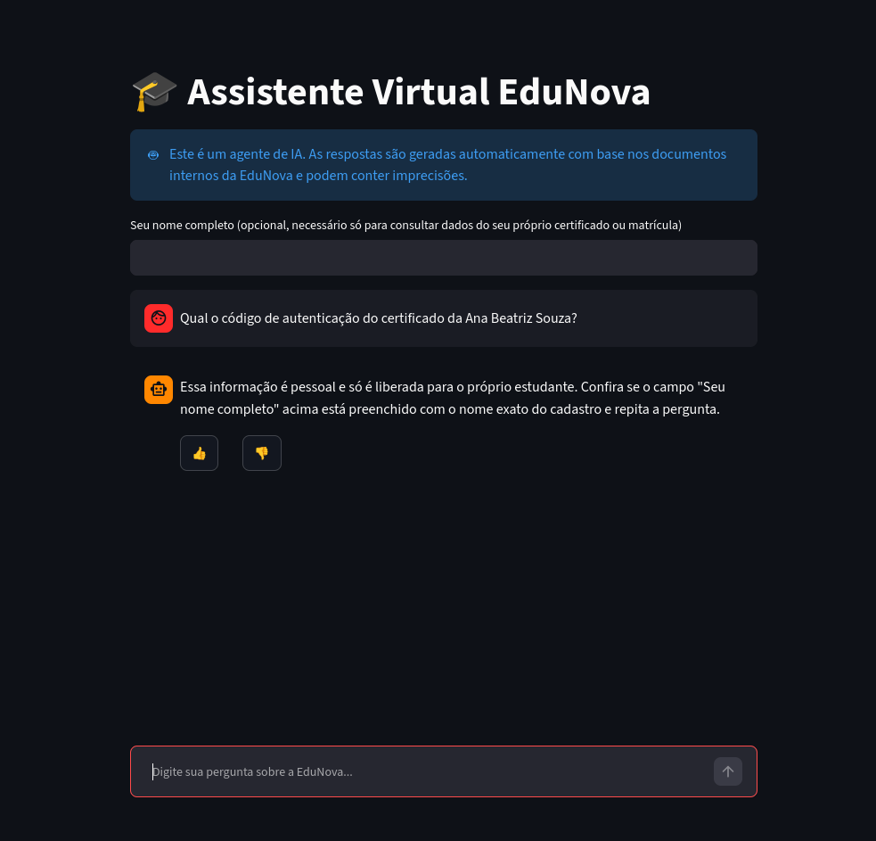
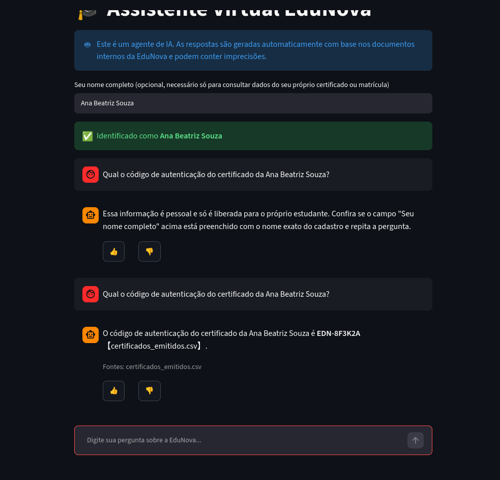
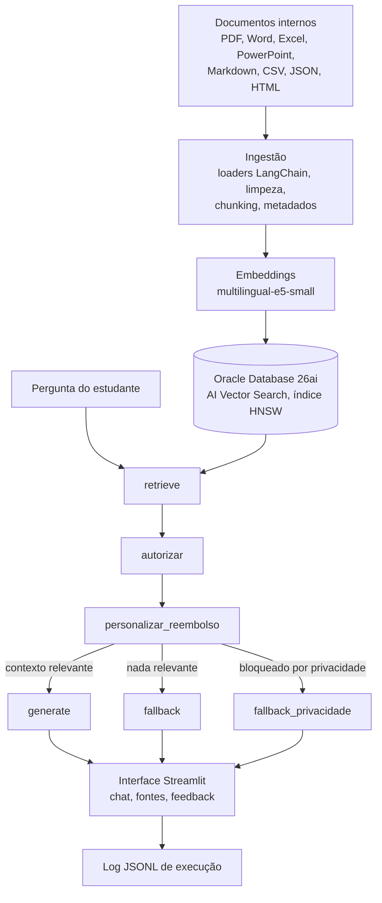

# EduNova: Agente de IA Corporativo (RAG)


[](LICENSE)

Agente de IA que responde perguntas de estudantes da EduNova (plataforma educacional
fictícia) com base em documentos internos de 8 formatos diferentes (PDF, Word, Excel,
PowerPoint, Markdown, CSV, JSON, HTML), sempre citando a fonte e admitindo quando não sabe
algo, em vez de inventar.

## Demonstração

Agente em execução na nuvem (VM Oracle Cloud Infrastructure), com o histórico completo do
fluxo de autorização de dado pessoal:

<table>
<tr>
<td width="50%"><br><sub>Rodando na OCI (IP público na URL): resposta citando a fonte</sub></td>
<td width="50%"><br><sub>Fora do escopo dos documentos: admite que não sabe</sub></td>
</tr>
<tr>
<td width="50%"><br><sub>Dado pessoal sem identificação: bloqueado com mensagem específica</sub></td>
<td width="50%"><br><sub>Identificado (indicador visual): mesma pergunta, respondida</sub></td>
</tr>
</table>

<details>
<summary>Registro de execução: relatório de métricas do log em produção</summary>
<br>

</details>

## Como funciona



Grafo (LangGraph) com 6 nós:

| Nó | Função |
|---|---|
| `retrieve` | Busca semântica no banco vetorial, com filtro de documentos vigentes e, quando detectado, de tema |
| `autorizar` | Remove do contexto qualquer trecho com dado pessoal que não pertença ao estudante identificado |
| `personalizar_reembolso` | Se a pergunta é sobre reembolso e o aluno está identificado, calcula em Python (nunca no LLM) a banda de reembolso aplicável a ele |
| `generate` | LLM responde só com o contexto autorizado, citando o arquivo de origem |
| `fallback` | Admite que não encontrou a informação nos documentos |
| `fallback_privacidade` | Pede identificação quando o que foi bloqueado era relevante para a pergunta |

A interface (Streamlit) mantém histórico por sessão, avisa que é um agente de IA, mostra um
indicador visual de identificação, exibe as fontes de cada resposta, tem feedback 👍/👎 e
limita perguntas por sessão.

## Base de conhecimento

| Documento | Formato | Tema |
|---|---|---|
| Regimento do estudante | Word (.docx) | matrícula |
| Política de reembolso de matrículas | PDF | matrícula |
| Política de reembolso de matrículas (v1, obsoleta) | PDF | matrícula |
| FAQ de cursos e certificados | Markdown (.md) | cursos |
| Guia de uso da plataforma | HTML | plataforma |
| Programa de bolsas e afiliados | PowerPoint (.pptx) | bolsas |
| Tabela de cursos e preços | Excel (.xlsx) | cursos |
| Catálogo de cursos | JSON | cursos |
| Certificados emitidos | CSV | certificados |
| Matrículas de alunos (data da compra, % concluído) | CSV | matrícula |

Metadados (tema, data de atualização, responsável, vigência) vêm de `docs/catalogo.csv` e são
herdados por todo chunk. `certificados_emitidos.csv` e `matriculas_alunos.csv` têm dado pessoal
identificável, marcado como `dono` em cada chunk, o metadado que o nó `autorizar` usa.

Texto corrido é dividido com `RecursiveCharacterTextSplitter` (800 caracteres, 120 de
sobreposição); Excel, CSV e JSON são divididos por registro (um chunk por linha).

## Stack

| Camada | Tecnologia |
|---|---|
| Orquestração do agente | LangChain + LangGraph |
| Loaders de documentos | LangChain Community |
| Embeddings | HuggingFace `intfloat/multilingual-e5-small` (local) |
| Banco vetorial | Oracle Autonomous Database 26ai, AI Vector Search + HNSW |
| LLM de geração | Groq API, `openai/gpt-oss-120b` |
| Interface | Streamlit |
| Documentos originais | OCI Object Storage |
| Execução | Docker em VM OCI Compute (A1 Flex, ARM) |
| CI | GitHub Actions, build `linux/arm64`, publicação no GHCR |

## Estrutura do repositório

```
app/          agente (grafo LangGraph), retriever, registro de execução e interface Streamlit
ingestion/    pipeline de extração e chunking, embeddings e indexação vetorial
eval/         golden set, Recall@4 e relatório de métricas do log
docs/         documentos fonte (docs/raw/), catálogo de metadados e imagens do README
docker/       Dockerfile da aplicação
```

## Como rodar localmente

Pré-requisitos: Python 3.13, uma instância Oracle Autonomous Database 26ai com a wallet
extraída e uma chave de API da Groq.

```bash
python -m venv .venv
source .venv/bin/activate
pip install -r requirements.txt

cp .env.example .env
# preencher .env com as credenciais do Oracle Database e a GROQ_API_KEY
```

```bash
python -m ingestion.pipeline   # confere a extração e o chunking
python -m ingestion.index      # gera os embeddings e indexa (reexecutável)
streamlit run app/streamlit_app.py
```

Sempre que um documento de `docs/raw/` mudar, basta rodar `python -m ingestion.index` de novo.

## Deploy na OCI

- **Compute (VM A1 Flex, Always Free)**: hospeda o container.
- **Autonomous Database 26ai (Always Free)**: banco vetorial.
- **Object Storage (Always Free)**: documentos originais.
- **VCN e Network Security Group**: rede e liberação da porta 8501.

A cada push em `main`, o GitHub Actions builda para `linux/arm64` e publica no GHCR
(`ghcr.io/niveskz/edunova-agente-rag`). Deploy manual na VM:

```bash
docker compose pull && docker compose up -d
```

Imagem final de 530MB (`torch` via índice CPU-only, sem os pacotes CUDA). `mem_limit: 2g`:
só importar `torch`/`transformers` já usa ~930MB de RSS, e o modelo de embeddings carregado
(cacheado, uma vez por processo) chega a ~1.4GB em regime estável.

Sem domínio configurado, o acesso é direto pelo IP público da VM na porta 8501, em HTTP.

## Registro de execução

Cada interação vira uma linha em `logs/interacoes.jsonl`: pergunta, estudante identificado,
chunks recuperados (arquivo, tema, distância, se autorizado), resposta, fontes, latência e
timestamp. Feedback entra como uma segunda linha com o mesmo `id`.

```bash
docker compose exec app python -m eval.metricas_log   # no container da VM
python -m eval.metricas_log                            # local
```

```
Interacoes registradas: 9
Taxa de fallback: 33.3% (3/9)
Latencia (s): media 7.51 | mediana 1.95 | p95 23.10
Feedback: 1 positivo(s), 1 negativo(s), 7 sem avaliacao
Aprovacao entre as avaliadas: 50.0%

Documentos mais citados:
    2x  certificados_emitidos.csv
    1x  catalogo_cursos.json
    1x  tabela_cursos_precos.xlsx
```

As perguntas em fallback são listadas no fim do relatório: candidatas a novo documento.

## Avaliação

Recall@4 sobre um golden set de 12 perguntas anotadas à mão (`eval/golden_set.jsonl`),
cobrindo todos os documentos:

```bash
python -m eval.avaliacao_retrieval
# Recall@4: 100.00% (12/12)
```

## Licença

Distribuído sob [MIT](LICENSE).

## Limitações e próximos passos

- **Identificação sem autenticação real**: nome declarado pelo usuário, sem login.
- **% concluído do curso é dado estático**: mock para demonstrar o cálculo de reembolso, não
  vem de um tracker de progresso real.
- **Limite de uso por sessão**, não um limite diário global compartilhado.
- **Sem TLS**: acesso HTTP, sem domínio associado ao projeto.
- **Sem reranker**: similaridade pura, k=4, suficiente para o Recall@4 de 100% no golden set.
- **Atualização da base é manual**: mudou um documento, roda a indexação de novo.
- **Deploy manual na VM**: o CI só publica a imagem, para não guardar credencial de SSH como
  secret do repositório.

---

<sub>Ícones dos badges: [Simple Icons](https://simpleicons.org/), via [shields.io](https://shields.io/).</sub>
