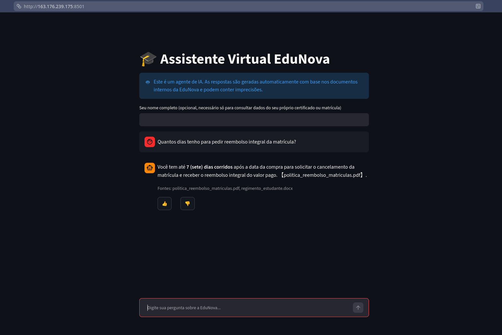
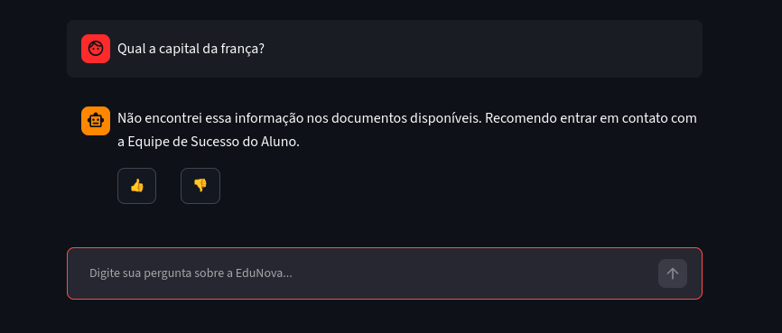
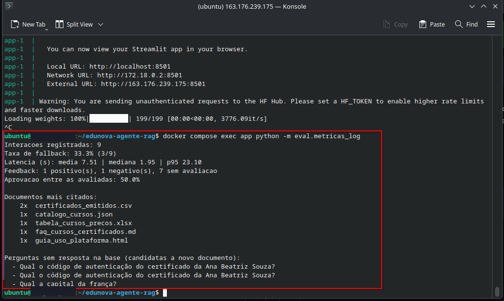
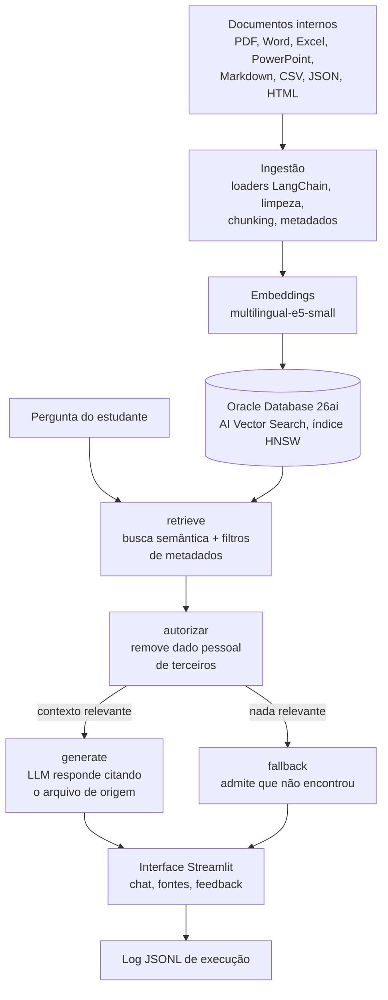

# EduNova, Agente de IA Corporativo (RAG)

Agente de IA que responde perguntas de estudantes e colaboradores da EduNova (plataforma
educacional fictícia) com base nos documentos internos da empresa, sempre citando a fonte
usada em cada resposta e admitindo quando não sabe algo, em vez de inventar.

Times de suporte recebem repetidamente as mesmas perguntas (política de reembolso, carga
horária de cursos, regras de certificado, uso da plataforma, programa de bolsas), e essas
respostas já existem espalhadas em documentos de formatos diferentes (PDF, Word, Excel,
PowerPoint, Markdown, CSV, JSON e HTML). O agente centraliza essa busca em uma única
interface de conversa.

## Demonstração

Agente em execução na nuvem, em uma VM da Oracle Cloud Infrastructure (OCI), respondendo e
citando o documento de origem:



Quando a pergunta não é coberta pelos documentos, o agente diz isso explicitamente em vez de
arriscar uma resposta inventada:



Dado pessoal (código de autenticação de certificado) só é liberado para o próprio estudante.
Sem identificação, o trecho é removido do contexto antes da geração da resposta:


Registro de execução: métricas calculadas a partir do log de interações do container em
produção (taxa de fallback, latência, feedback e documentos mais citados):



## Como funciona



O agente é um grafo (LangGraph) com 4 nós:

1. **retrieve**: busca por similaridade semântica os trechos mais relevantes para a pergunta
   no banco vetorial. Dois filtros de metadados são aplicados: apenas documentos vigentes
   (versões antigas já revisadas continuam indexadas para auditoria, mas nunca chegam ao LLM)
   e, quando a pergunta menciona claramente um dos temas do catálogo, apenas aquele tema.
2. **autorizar**: remove do contexto qualquer trecho com dado pessoal que não pertença ao
   estudante identificado na conversa. Sem identificação, todo trecho com dono definido é
   descartado.
3. **generate**: o LLM responde usando só o que restou depois da busca e da autorização,
   citando o arquivo de origem de cada informação. Se os trechos recuperados forem pouco
   relacionados com a pergunta (distância acima do limiar calibrado) ou tiverem sido todos
   removidos na autorização, o grafo desvia para o fallback em vez de arriscar uma resposta.
4. **fallback**: resposta fixa avisando que a informação não foi encontrada nos documentos
   disponíveis, com indicação de contato com a Equipe de Sucesso do Aluno.

A interface (Streamlit) mantém o histórico da conversa na sessão, deixa claro que se trata de
um agente de IA, exibe as fontes de cada resposta e permite avaliar cada uma com 👍/👎.

## Base de conhecimento

Nove arquivos fictícios em `docs/raw/`, um por formato exigido, mais uma versão desatualizada
de uma política para exercitar a curadoria. Os metadados de cada documento (tema, data de
atualização, responsável e status de vigência) vêm de `docs/catalogo.csv` e são herdados por
todos os chunks gerados.

| Documento | Formato | Tema |
|---|---|---|
| Regimento do estudante | Word (.docx) | matrícula |
| Política de reembolso de matrículas | PDF | matrícula |
| Política de reembolso de matrículas (v1, obsoleta) | PDF | matrícula |
| FAQ de cursos e certificados | Markdown (.md) | cursos |
| Guia de uso da plataforma | HTML | plataforma |
| Programa de bolsas e afiliados | PowerPoint (.pptx) | bolsas |
| Tabela de cursos e preços | Excel (.xlsx) | cursos |
| Catálogo de cursos | JSON | cursos |
| Certificados emitidos | CSV | certificados |

Documentos de texto corrido são divididos com `RecursiveCharacterTextSplitter` (800
caracteres, 120 de sobreposição); Excel, CSV e JSON são divididos por registro, um chunk por
linha, preservando o cabeçalho em cada um.

## Stack utilizada

| Camada | Tecnologia |
|---|---|
| Orquestração do agente | LangChain + LangGraph |
| Loaders de documentos | LangChain Community (PDF, Word, Excel, PowerPoint, Markdown, CSV, JSON, HTML) |
| Embeddings | HuggingFace `intfloat/multilingual-e5-small` (local, sem custo de API) |
| Banco vetorial | Oracle Autonomous Database 26ai, AI Vector Search com índice HNSW |
| LLM de geração | Groq API, modelo `openai/gpt-oss-120b` |
| Interface | Streamlit |
| Documentos originais | OCI Object Storage |
| Execução | Docker em VM OCI Compute (A1 Flex, ARM) |
| CI | GitHub Actions, build `linux/arm64` e publicação no GHCR |

## Estrutura do repositório

```
app/          agente (grafo LangGraph), retriever, registro de execução e interface Streamlit
ingestion/    pipeline de extração e chunking, embeddings e indexação vetorial
eval/         golden set, Recall@4 e relatório de métricas do log
docs/         documentos fonte (docs/raw/), catálogo de metadados e imagens do README
docker/       Dockerfile da aplicação
```

## Como rodar localmente

Pré-requisitos: Python 3.13, uma instância Oracle Autonomous Database 26ai com a wallet
extraída e uma chave de API da Groq.

```bash
python -m venv .venv
source .venv/bin/activate
pip install -r requirements.txt

cp .env.example .env
# preencher .env com as credenciais do Oracle Database e a GROQ_API_KEY
```

Processar os documentos e indexar no banco vetorial (reexecutável, recria a tabela do zero):

```bash
python -m ingestion.pipeline   # confere a extração e o chunking
python -m ingestion.index      # gera os embeddings e indexa
```

Rodar a interface:

```bash
streamlit run app/streamlit_app.py
```

Sempre que um documento de `docs/raw/` mudar, basta rodar `python -m ingestion.index` de novo.

## Deploy na OCI

Serviços OCI usados:

- **Compute (VM A1 Flex, Always Free)**: hospeda o container da aplicação.
- **Autonomous Database 26ai (Always Free)**: banco vetorial com AI Vector Search nativo.
- **Object Storage (Always Free)**: guarda os documentos originais.
- **VCN e Network Security Group**: rede da VM e liberação da porta da aplicação.

A cada push em `main`, o GitHub Actions builda a imagem (`docker/Dockerfile`) para
`linux/arm64` (arquitetura da VM A1 Flex) e publica no GHCR
(`ghcr.io/niveskz/edunova-agente-rag`). O deploy na VM é manual:

```bash
# na VM, num diretorio com docker-compose.yml, .env (permissao 600) e wallet/
docker compose pull
docker compose up -d
```

O container serve apenas a interface Streamlit na porta 8501; o banco vetorial já populado e
os documentos originais são serviços externos, sem custo de compute adicional. A imagem final
tem 530MB, com o `torch` instalado a partir do índice CPU-only para não arrastar os pacotes
CUDA (que levavam a imagem a mais de 9GB, inviável na VM Always Free).

Sem domínio configurado, o acesso é direto pelo IP público da VM na porta 8501, em HTTP.

## Registro de execução

Cada interação gera uma linha em `logs/interacoes.jsonl` (volume persistido fora do container)
com pergunta, estudante identificado, chunks recuperados (arquivo, tema, distância e se
passaram pela autorização), resposta, fontes citadas, latência e timestamp. O voto de feedback
entra como uma segunda linha com o mesmo `id` da interação.

Isso dá rastreabilidade completa: para qualquer resposta é possível reconstruir exatamente
quais trechos de quais documentos foram usados. O relatório sob demanda:

```bash
python -m eval.metricas_log                                    # local
docker compose exec app python -m eval.metricas_log            # no container da VM
```

```
Interacoes registradas: 4
Taxa de fallback: 50.0% (2/4)
Latencia (s): media 5.32 | mediana 5.19 | p95 5.87
Feedback: 1 positivo(s), 1 negativo(s), 2 sem avaliacao
Aprovacao entre as avaliadas: 50.0%

Documentos mais citados:
    1x  politica_reembolso_matriculas.pdf
    1x  regimento_estudante.docx
    1x  certificados_emitidos.csv
```

As perguntas que caíram em fallback são listadas no fim do relatório: são as candidatas
naturais a virar documento novo na base.

## Avaliação

A qualidade da recuperação é medida por Recall@4 sobre um golden set de 12 perguntas anotadas
à mão (`eval/golden_set.jsonl`), cobrindo todos os documentos da base:

```bash
python -m eval.avaliacao_retrieval
# Recall@4: 100.00% (12/12)
```

## Limitações e próximos passos

- **Identificação sem autenticação real**: o filtro de dado pessoal usa o nome declarado pelo
  próprio usuário, sem login. Serve para demonstrar a separação de contexto, mas em produção
  exigiria autenticação de verdade.
- **Sem TLS**: o acesso é HTTP pelo IP público, já que o projeto não tem domínio associado.
- **Sem reranker**: a busca é por similaridade pura, com k=4. O Recall@4 de 100% no golden set
  não justificou a peça extra neste volume de documentos.
- **Atualização manual da base**: mudou um documento, roda a indexação de novo. Para um corpus
  de nove arquivos, uma rotina automática seria complexidade sem retorno.
- **Deploy manual**: o CI publica a imagem, mas o `docker compose pull && up -d` na VM é feito
  à mão, para não guardar credencial de SSH da VM como secret do repositório.
